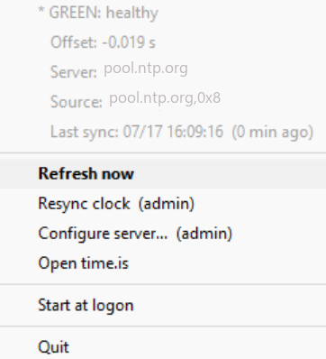

# NTP Time Sync

A tiny Windows system-tray light for **Windows Time (w32time) sync health**.
Green means your PC clock is accurate; red means it isn't. No dialog to open,
no numbers to read — just a dot by the clock.


> **Why it exists:** FT8/FT4 digital modes (WSJT-X and friends) need the PC
> clock within about **1 second of UTC** or *nothing decodes*, even with strong
> signals in the waterfall. "Signals but no decodes" is almost always a clock
> problem. This app makes that failure visible at a glance — but it's useful to
> anyone who depends on an accurate Windows clock.

## The light

| Color  | Meaning |
|--------|---------|
| 🟢 Green  | Synced to the configured server and \|offset\| < 1 s |
| 🟡 Yellow | Synced but drifting (1–2 s) or last sync is stale (> 40 min) |
| 🔴 Red    | Wrong source, not synced, offset > 2 s, or server unreachable |
| ⚪ Gray   | Starting up / probe error |

Hover the icon for a one-line summary; right-click for the full readout and actions.

## Right-click menu



- **Status readout** — color/reason, offset, server, source, last sync (live)
- **Refresh now** — re-probe immediately (also the double-click default)
- **Resync clock (admin)** — `w32tm /resync /force`; opens an elevated PowerShell (UAC)
- **Configure server… (admin)** — change the NTP server, then applies it elevated (UAC)
- **Open time.is** — browser sanity check
- **Start at logon** — toggles an HKCU `Run` entry (per-user, no admin)
- **Quit**

Polling is read-only and runs **non-elevated**. Only Resync and Configure need
admin, so they raise a UAC prompt on demand instead of the whole app running
elevated.

## Install

Requires **Python 3.8+** on Windows.

```
pip install -r requirements.txt
```

## Run

Double-click `ntp_time_sync.pyw` (runs windowless via `pythonw`), or:

```
pythonw ntp_time_sync.pyw
```

Enable **Start at logon** from the menu to have it come up automatically.

### ⚠️ Windows 11: make the icon visible

Windows 11 **hides new tray icons by default** — the app is running, but the dot
won't appear on the taskbar until you allow it once:

**Settings → Personalization → Taskbar → Other system tray icons →** turn
**NTP Time Sync** (a `python`/`pythonw` entry) **On**.

This is a one-time, per-app Windows setting; it sticks afterward. (Windows 10
shows the icon automatically.)

## Configure

`config.json` is created next to the script on first run. Defaults:

```json
{
  "server": "pool.ntp.org",
  "poll_seconds": 45,
  "green_max_offset": 1.0,
  "yellow_max_offset": 2.0,
  "stale_minutes": 40
}
```

- **server** — any NTP host or IP. Public pool by default; point it at a LAN
  time server if you run one (e.g. `192.0.2.10` or a GPS-disciplined NTP box).
- **green_max_offset / yellow_max_offset** — thresholds in seconds.
- **poll_seconds** — how often to probe.
- **stale_minutes** — if the last successful sync is older than this, don't show green.

Edit and restart, or use **Configure server…** to change the server from the UI.

## How it works

Read-only polling shells out to the built-in Windows tools:

- `w32tm /query /status` — current source and last successful sync time
- `w32tm /stripchart /computer:<server> /samples:1` — live offset vs. the server

No third-party time daemon required; it reports on whatever Windows Time is
already doing. The admin actions just wrap `w32tm /config` and `w32tm /resync`.

## Requirements

- Windows (uses `w32tm` and the Win32 notification area)
- Python 3.8+ with `pystray` and `Pillow`

## Author

David Erickson (AB0R). Contributions and issues welcome.

## License

GPLv3 — see [LICENSE](LICENSE). Copyright (C) 2026 David Erickson (AB0R).
