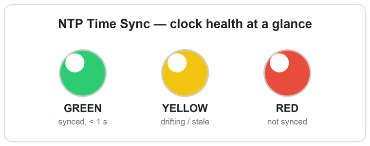
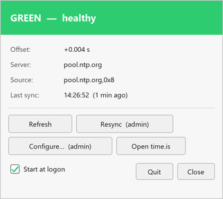

# NTP Time Sync

A tiny Windows system-tray light for **Windows Time (w32time) sync health**.
Green means your PC clock is accurate; red means it isn't. No dialog to open,
no numbers to read — just a dot by the clock.



> **Why it exists:** FT8/FT4 digital modes (WSJT-X and friends) need the PC
> clock within about **1 second of UTC** or *nothing decodes*, even with strong
> signals in the waterfall. "Signals but no decodes" is almost always a clock
> problem. This app makes that failure visible at a glance — but it's useful to
> anyone who depends on an accurate Windows clock.

## Download (recommended)

A single self-contained executable — **no Python, no dependencies.**

**⬇ [Download the latest `NTP-Time-Sync.exe`](https://github.com/gsa700/ntp-time-sync/releases/latest)**

1. **Double-click** the downloaded `.exe`.
2. **Windows SmartScreen** may say *"Windows protected your PC"* because the app isn't
   code-signed. Click **More info → Run anyway**. It's open source; every line is in this repo.
3. It asks whether to **install**:
   - **Yes** — copies itself into your user profile, starts at logon, and appears in
     **Settings → Apps → Installed apps** so you can remove it later. You don't pick a
     folder or see any paths; delete the download afterward.
   - **No** — just runs once from where it is, installing nothing.
4. A colored dot appears in the system tray. If it doesn't, see
   [Make the icon visible](#make-the-icon-visible-windows-11) below.

That's it. Settings are created automatically; to find or edit them later, right-click the
tray icon and choose **Open settings folder**. To remove the app, see [Uninstall](#uninstall)
below — it can also put your Windows Time settings back the way they were.

### Portable edition (run from anywhere)

Prefer to run it off a USB stick, or on a machine you can't or won't install on?

**⬇ [Download `NTP-Time-Sync-portable.zip`](https://github.com/gsa700/ntp-time-sync/releases/latest)**

Extract it anywhere and run the `.exe`. Because a `portable.txt` marker sits beside it, the
app **keeps its settings in that folder, never installs itself, and touches nothing on the
machine** — no Start-at-logon entry, no *Installed apps* listing. Delete the folder and it's
gone without a trace. (Delete `portable.txt` if you later want that copy to install normally.)

## Make the icon visible (Windows 11)

Usually nothing to do — the dot normally appears on its own. But Windows 11 can
**hide new tray icons**, in which case the app is running and the dot simply isn't
on the taskbar. If that happens:

**Settings → Personalization → Taskbar → Other system tray icons →** turn the
**NTP Time Sync** entry **On**.

One-time and per-app; it sticks afterward. (Windows 10 shows the icon automatically.)

## The light

| Color  | Meaning |
|--------|---------|
| 🟢 Green  | Clock accurate — \|offset\| < 1 s vs. the reference server |
| 🟡 Yellow | Drifting (1–2 s), the Windows Time service isn't running, not NTP-synced (on the free-running CMOS clock), or last sync stale (> 40 min) |
| 🔴 Red    | \|offset\| > 2 s, or the reference server is unreachable |
| ⚪ Gray   | Starting up / probe error |

The light follows your **clock's actual accuracy** (the measured offset), so it works
no matter which NTP server Windows itself uses — you don't have to match the server
below. It separately flags the case that started this project: Windows silently
falling back to the free-running CMOS clock.

Hover the icon for a one-line summary; **left-click** to open the panel.

## The panel

**Left-click** the tray dot to open the status panel — a solid status-colored
header over the live readout, with every action one click away:



- **Colored header** — green / yellow / red with the reason, readable at a glance
- **Readout** — offset, server, source, last sync (updates live while open)
- **Refresh** — re-probe immediately
- **Resync (admin)** — starts the time service if needed, then `w32tm /resync /force`;
  opens an elevated PowerShell (UAC)
- **Start service (admin)** — appears only when the Windows Time service is stopped;
  offers to also set it to start at boot (see below)
- **Configure… (admin)** — change the NTP server; applies it elevated (UAC) and sets
  Windows Time to start automatically, so it keeps syncing across reboots
- **Open time.is** — browser sanity check
- **Close**

**Right-click** the dot for the rest: **Start at logon** (on by default),
**Check for updates**, **Auto-check on startup** (off by default),
**Open settings folder**, and **Quit**. A loose (not-yet-installed) copy also shows
**Install NTP Time Sync…**.

When a newer release exists, **Check for updates** offers to **download and install
it in place**, then asks to **Restart now** to finish (or choose No — it also starts
at your next sign-in). No manual re-download; no admin needed. Auto-check only
*notifies* — installing is always a click.

Polling is read-only and runs **non-elevated**; only Resync and Configure raise
a UAC prompt on demand.

## Uninstall

Remove it the normal way — **Settings → Apps → Installed apps → NTP Time Sync →
Uninstall** (or **Uninstall…** in the tray right-click menu). It clears its
Start-at-logon shortcut and *Installed apps* entry, then asks two things:

- **"Also remove your saved settings?"** — **Yes** deletes your `config.json` (server,
  thresholds); **No** keeps it, so a later reinstall picks up where you left off.
- **"Restore Windows Time to how it was before the app was installed?"** — if the app
  ever changed your Windows Time setup (via **Configure** or **Start service**), it
  snapshotted the previous state at install time and can put it back: reference server,
  sync type, and start mode. Needs a UAC prompt. Choose **No** to leave your current,
  working time settings alone — sensible if the app fixed a clock that wasn't syncing
  before and you'd rather keep it that way.

The **portable** edition installs nothing, so there's nothing to uninstall — just delete
its folder and it's gone without a trace.

## Run from source (developers)

Requires **Python 3.8+** on Windows.

```
pip install -r requirements.txt
pythonw ntp_time_sync.pyw
```

Double-clicking `ntp_time_sync.pyw` also works (runs windowless via `pythonw`).

Running from source never touches the installed app: it uses its own
`NtpTimeSync-dev` startup entry, never offers to install itself, and keeps its
`config.json` next to the script rather than in `%APPDATA%` — so a dev checkout and
an installed copy stay fully separate.

The packaged `.exe` decides its behavior at launch from where it's run: from the
per-user install dir it runs installed (config in `%APPDATA%`, starts at logon,
listed in *Installed apps*); with a `portable.txt` marker beside it, portable (config
local, no trace); anywhere else, loose — it offers to install on first run. Silent
`--install` and `--uninstall` (add `--quiet`) flags drive those without prompts.

### Build & update your install

One command rebuilds the exe and updates your installed copy (stops it, overwrites
the installed exe wherever it lives, relaunches). Settings in `%APPDATA%` are
preserved. Every build also refreshes `dist\NTP-Time-Sync.exe` and the portable zip:

```
.\build.ps1              # build + update your install
.\build.ps1 -NoDeploy    # just build into dist\ (exe + portable zip)
```

First-time build deps: `pip install pyinstaller`.

### Cut a release (for sharing)

Bump `APP_VERSION` in `ntp_time_sync.pyw` first, then `.\build.ps1 -NoDeploy` (which
produces both `dist\NTP-Time-Sync.exe` and `dist\NTP-Time-Sync-portable.zip`), then
publish **both** assets so others can download them:

```
# Write the notes to a file, then upload both the exe and the portable zip:
gh release create vX.Y.Z `
    "dist\NTP-Time-Sync.exe" "dist\NTP-Time-Sync-portable.zip" `
    --title "NTP Time Sync vX.Y.Z" --notes-file notes.md
```

Use `--notes-file`, not `--notes "..."`. Windows PowerShell 5.1 mangles a multi-line
string on its way to a native `.exe` — it arrives split on whitespace, and `gh` fails
with something unhelpful like ``no matches found for `but` `` (it read a stray word as
a file glob). Single-line notes are fine either way; a file always is.

`README` links to `/releases/latest`, so it always points at the newest.

## When the time service isn't running

A fresh, non-domain Windows install leaves **Windows Time set to start manually**
(trigger-start), and it is often simply *stopped*. Nothing looks wrong — but nothing
is disciplining your clock either, so it free-runs and drifts. This is a common
cause of "signals but no decodes."

The app shows this as **yellow — "Windows Time service not running"**, and the panel
grows a **Start service (admin)** button. Because a manually-started service can stop
again after a reboot, that button also offers to set it to **start automatically**.
That's a persistent change to a system service, so it's always an explicit choice —
answer **No** to just start it this once.

Every `w32tm /query` fails with `0x80070426` ("The service has not been started")
while it's stopped, which is why **Resync** starts the service before resyncing.

## Configure

Settings live in a `config.json` file. You don't need to hunt for it — right-click the
tray icon and choose **Open settings folder** to open it in Explorer (it's created on
first run). Its defaults:

```json
{
  "server": "pool.ntp.org",
  "poll_seconds": 45,
  "green_max_offset": 1.0,
  "yellow_max_offset": 2.0,
  "stale_minutes": 40,
  "dns_cache_minutes": 30,
  "auto_check_updates": false,
  "require_server": false
}
```

- **server** — the **reference** the app measures your clock offset against. Any NTP
  host or IP; public pool by default. Point it at a LAN time server if you run one
  (e.g. `192.0.2.10` or a GPS-disciplined NTP box).
- **green_max_offset / yellow_max_offset** — thresholds in seconds.
- **poll_seconds** — how often to probe.
- **stale_minutes** — if the last successful sync is older than this, don't show green.
- **dns_cache_minutes** — how long to reuse the server's resolved IP. A hostname would
  otherwise be looked up on *every* poll — at the default 45 s that's ~1,900 DNS queries
  a day, enough to look like abuse to a local resolver (`pool.ntp.org` in particular
  rotates answers on a short TTL). Pinning one address also keeps consecutive samples
  on the same server. A failed probe re-resolves immediately, so a dead address
  self-corrects. Set `0` to resolve every poll; ignored when the server is an IP.
- **auto_check_updates** — check GitHub for a newer release at startup (toggle from the menu).
- **require_server** — if `true`, also warn (yellow) unless Windows is syncing to this
  exact server. Off by default (the light follows your clock's accuracy regardless of
  which server Windows uses). Turn it on if you run a dedicated source and want to be
  told when Windows isn't using it.

`start_at_logon` records whether you want the app to start at logon (toggle it from
the tray menu, not by hand); the installed copy keeps its Startup-folder shortcut in
step with it on every launch. `w32time_baseline`, written once at install, snapshots
your Windows Time configuration from just before the app first changed it, so
[uninstall](#uninstall) can offer to restore it — both are managed automatically, leave
them.

To change a setting: **Open settings folder**, edit `config.json`, and restart the app.
To change just the server, the **Configure…** button in the panel does it from the UI —
no file editing.

## How it works

Read-only polling shells out to the built-in Windows tools:

- `w32tm /query /status` — current source and last successful sync time
- `w32tm /stripchart /computer:<server> /samples:1` — live offset vs. the server

No third-party time daemon required; it reports on whatever Windows Time is
already doing. The admin actions just wrap `w32tm /config` and `w32tm /resync`.

## Requirements

- **The `.exe`:** Windows 10/11 — nothing else; Python and all libraries are bundled.
- **From source:** Python 3.8+ with `pystray` and `Pillow` (see `requirements.txt`).

Uses the built-in `w32tm` and the Win32 notification area.

## Author

David Erickson (AB0R). Contributions and issues welcome.

## License

GPLv3 — see [LICENSE](LICENSE). Copyright (C) 2026 David Erickson (AB0R).
